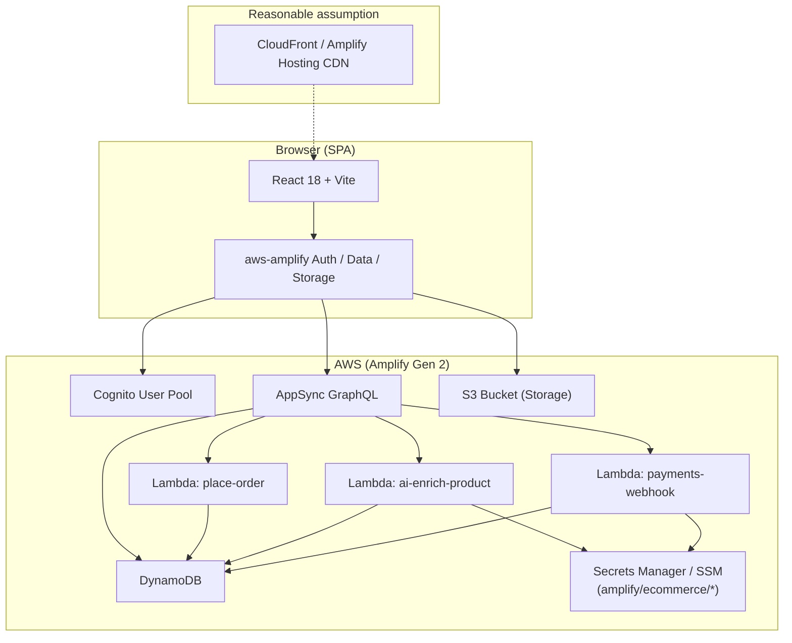
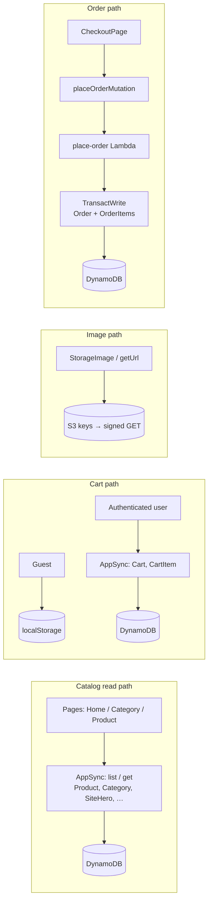
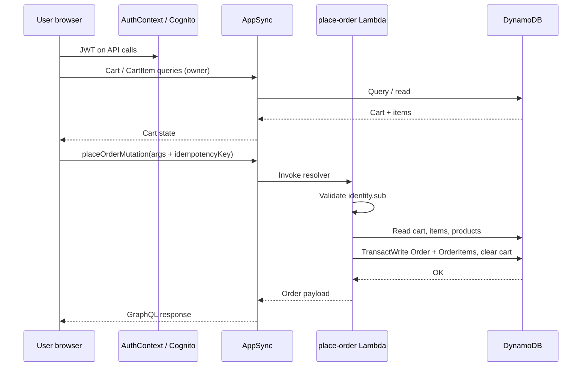
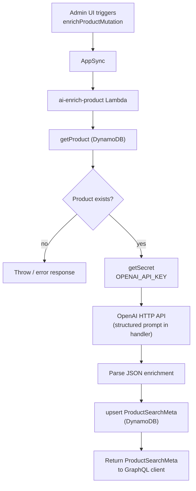
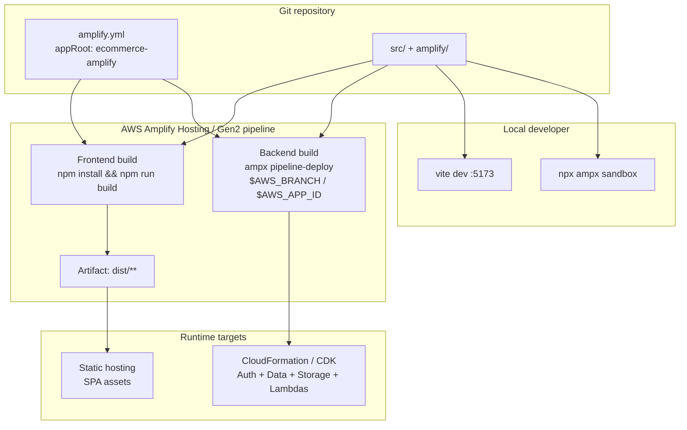
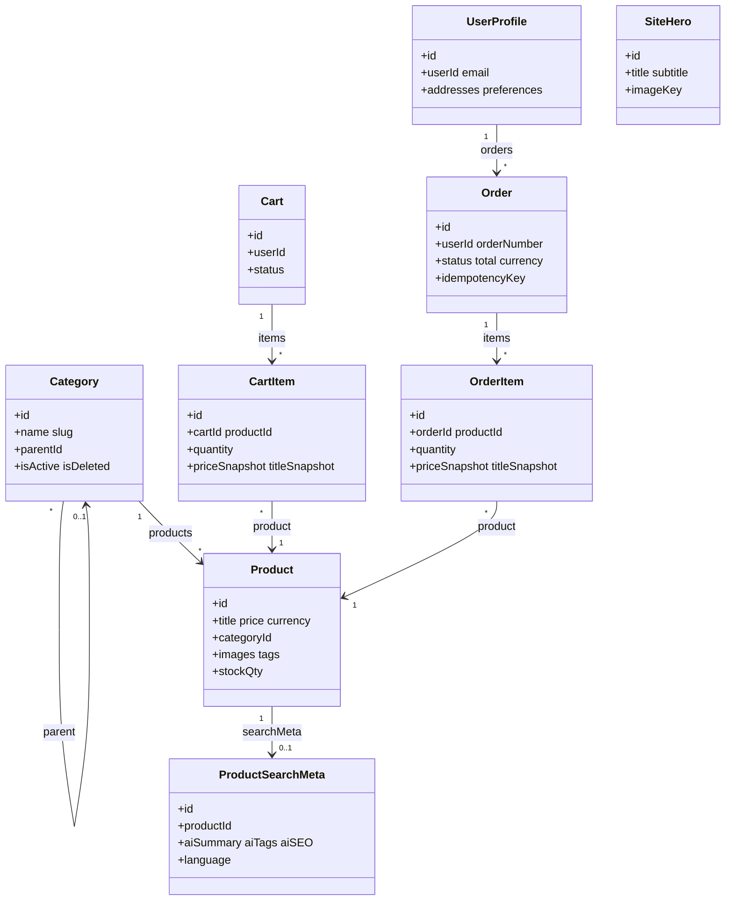

# Architecture Diagrams

Mermaid diagrams for **ecommerce-amplify**. They reflect the implementation in `amplify/` and `src/`; dashed lines indicate **reasonable assumptions** (e.g. CDN) where not defined in repo files.

---

## 1. System architecture

---

## 2. Data flow (catalog, cart, checkout)

---

## 3. Request lifecycle — authenticated checkout (sequence)

---

## 4. AI processing flow

---

## 5. Deployment architecture

---

## 6. Domain model (class diagram)

Amplify Data models from `amplify/data/resource.ts` — associations only (fields abbreviated).

---

## Diagram maintenance

- When you add Lambdas, models, or change `defineBackend`, update the matching diagram section (including **§6 class diagram**).
- If you add API Gateway REST APIs or Step Functions, introduce a new diagram — this stack is **GraphQL-centric** today.
