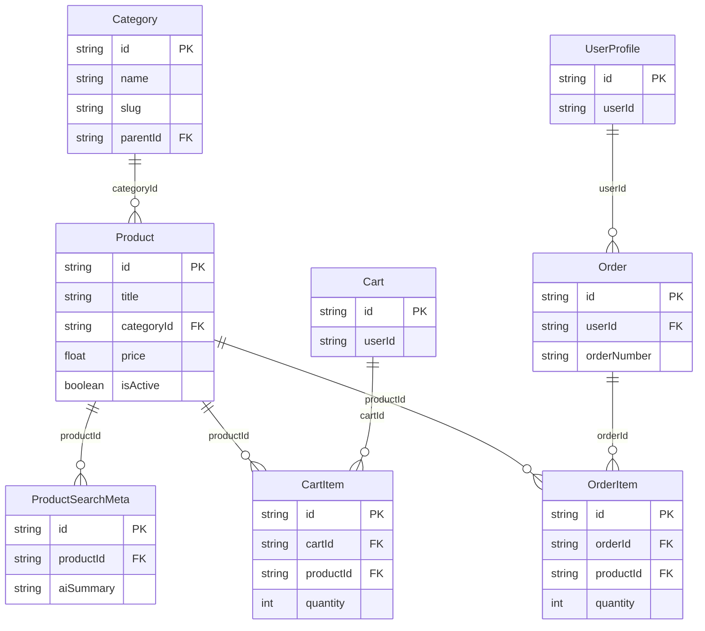
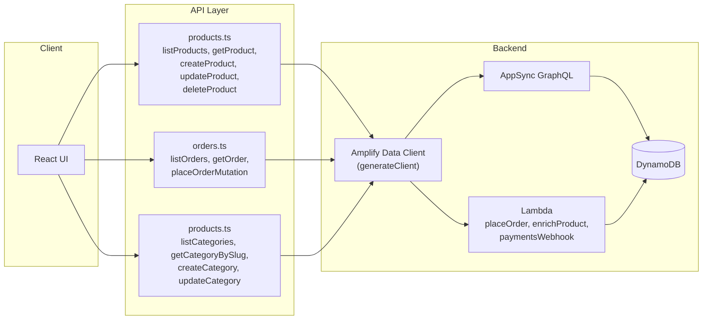

# Reset Products – Local Safe Reset & API Mapping

This document covers the **LOCAL-only** “reset products” flow, DB cleanup strategy, logical API mapping (Amplify Data / AppSync), logging, and diagrams.

---

## A) LOCAL CLI Command

### Command

```bash
# From repo root (e.g. c:\programming\AWSLambda\ecommerce-amplify)
npm run db:reset-products [options]

# Or directly
node scripts/reset-products.mjs [options]
```

### Flags

| Flag | Description |
|------|-------------|
| `--dry-run` | Only list what would be deleted; no writes. **Default-safe.** |
| `--yes` | Skip confirmation prompt. |
| `--limit N` | Cap total items deleted per model (for testing). |
| `--verbose` | Extra debug logs. |
| `--categories` | Also delete all **Category** records (after products). |

### Examples

```bash
# Safe: see what would be deleted
npm run db:reset-products:dry-run
# or
node scripts/reset-products.mjs --dry-run

# Actually reset (will prompt for "yes")
npm run db:reset-products

# Reset without prompt (still disabled in production)
npm run db:reset-products -- --yes

# Reset and clear categories too
npm run db:reset-products -- --yes --categories

# Limit to 10 items per model (testing)
node scripts/reset-products.mjs --dry-run --limit 10 --verbose
```

### Output

- **Structured logs (JSON):** `requestId`, `level`, `message`, `model`, `count`, `durationMs`, etc.
- **Summary:** deleted (or would-delete) counts per table:  
  `ProductSearchMeta`, `CartItem`, `OrderItem`, `Product`, and optionally `Category`.

Example summary:

```
--- Summary ---
  ProductSearchMeta: 5 (would delete)
  CartItem: 12 (would delete)
  OrderItem: 8 (would delete)
  Product: 42 (would delete)
```

---

## B) DB Cleanup Implementation

**Stack:** AWS Amplify Gen 2 → **DynamoDB** (AppSync/GraphQL). No SQL; no table drops.

### Referential order (safe delete order)

Deletes must respect dependencies so no FK-like references are left pointing at deleted items:

1. **ProductSearchMeta** (references `Product` via `productId`)
2. **CartItem** (references `Product` via `productId`)
3. **OrderItem** (references `Product` via `productId`, `Order` via `orderId` – we delete line items only; Orders remain)
4. **Product**
5. **Category** (only if `--categories`; Products already deleted)

Tables **Order**, **Cart**, **UserProfile** are **not** cleared by this script (schema preserved).

### DynamoDB strategy (current script)

- Uses **Amplify Data client** (`generateClient()`): `list()` with pagination (`nextToken`), then `delete({ id })` per item.
- No Scan/BatchWrite in the script; safe for local/sandbox. For very large datasets, a Lambda or a script using **DynamoDB Scan + BatchWriteItem** (batches of 25) would be used with the same order above; table names would come from env (e.g. `PRODUCT_TABLE_NAME` from sandbox).

### Optional: reset sequences / identity

- **DynamoDB has no sequences.** IDs are UUIDs from Amplify; no counters to reset.

### Safety

- **Production:** Script exits with error if `NODE_ENV === 'production'`.
- **Confirmation:** Without `--yes`, script prompts for typing `"yes"`.
- **Dry-run:** Use `--dry-run` first to see counts.

---

## C) REST / API Route Mapping

There is **no Express REST API** in this repo. Data access is via **Amplify Data (AppSync GraphQL)**. Below is the logical mapping: “route” = usage in the app and the corresponding backend.

### Product (CRUD)

| Method + path (logical) | Handler / usage | Service / API | Repository / DB |
|-------------------------|------------------|---------------|------------------|
| LIST products | `AdminProducts`, `ManagerProduct`, storefront | `listProducts()` in `src/lib/api/products.ts` | `client.models.Product.list()` |
| GET product | `ProductPage`, `AdminProductForm` | `getProduct(id)` | `client.models.Product.get({ id })` |
| CREATE product | `AdminProductForm`, `ManagerProduct`, CSV import | `createProduct(input)` | `client.models.Product.create(...)` |
| UPDATE product | `AdminProductForm`, `ManagerProduct` | `updateProduct(id, input)` | `client.models.Product.update(...)` |
| DELETE product | `AdminProducts`, `ManagerProduct` | `deleteProduct(id)` | `client.models.Product.delete({ id })` |

### Category

| Method + path (logical) | Handler / usage | Service / API | Repository / DB |
|-------------------------|------------------|---------------|------------------|
| LIST categories | `AdminProductForm`, `HomePage`, `AdminImportCSV`, `AdminCategories` | `listCategories()` / `listAllCategories()` | `client.models.Category.list()` |
| GET category by slug | `CategoryPage` | `getCategoryBySlug(slug)` | `client.models.Category.list({ filter: { slug } })` + fallback |
| GET category by id | Admin flows | `getCategoryById(id)` | `client.models.Category.get({ id })` |
| CREATE category | `AdminCategories`, `CategoryFormModal` | `createCategory(input)` | `client.models.Category.create(...)` |
| UPDATE category | `AdminCategories` | `updateCategory(id, input)` | `client.models.Category.update(...)` |
| DELETE category | `AdminCategories` | `deleteCategory(id)` | `client.models.Category.delete({ id })` |

### Product ↔ Category relation

- **Product** has `categoryId` → **Category**. No separate “relation route”; all through Product CRUD and Category list/get.
- Category list is used for dropdowns and filters; product list can be filtered by `categoryId` via `listProducts({ categoryId })` or `listProductsByCategory(categoryId)`.

### Custom mutations (Lambda)

| Logical operation | Handler | Service / API | Backend |
|-------------------|--------|---------------|---------|
| Place order | Checkout flow | `client.mutations.placeOrderMutation(...)` | `placeOrder` Lambda (DynamoDB transaction) |
| Enrich product (AI) | Admin product edit | `client.mutations.enrichProductMutation({ productId })` | `aiEnrichProduct` Lambda |
| Payment webhook | Payment provider | `client.mutations.processPaymentWebhook(...)` | `paymentsWebhook` Lambda |

**Request/response:** All go through Amplify-generated GraphQL; types are in `amplify/data/resource.ts` and frontend types in `src/lib/api/products.ts` (Product, Category, etc.).

---

## D) Logging

### In the reset script

- **Structured JSON logs** with:
  - `requestId`, `timestamp`, `level`, `message`
  - `model`, `count`, `durationMs`, `action` (e.g. dry_run / delete)
- **Levels:** `DEBUG`, `INFO`, `ERROR`.
- **Correlation:** `requestId` is generated once per run (`reset-<ts>-<random>`).

Example log line:

```json
{"timestamp":"2026-02-17T20:30:00.000Z","requestId":"reset-1739812200000-abc12de","level":"INFO","message":"Product delete","model":"Product","count":42,"durationMs":1200,"action":"completed"}
```

### If you add a REST layer (Express)

- **Route entry:** log `method`, `path`, `x-request-id` (or generate), `userId` (if auth).
- **Controller → Service → DB:** pass `requestId` and log at each layer with `action`, `productId`/`categoryId`, `status`, `durationMs`.
- **x-request-id:** read from request header; if missing, generate (e.g. UUID) and set on response; use in all logs.

Example (conceptual):

```json
{"timestamp":"2026-02-17T20:30:00.000Z","requestId":"req-550e8400-e29b-41d4-a716-446655440000","userId":"sub-123","route":"/api/products","method":"POST","action":"createProduct","productId":"prod-xyz","status":201,"durationMs":45}
```

---

## E) Diagrams

### ERD (product-related entities)



### Data / “REST” flow (Amplify Data)



---

## F) How to Run Locally

### 1. Prerequisites

- **Node.js** (e.g. 18+) from repo root (ecommerce-amplify).
- **Amplify config:** `amplify_outputs.json` in project root (from `npx ampx sandbox` or deploy).
- **Env:** `NODE_ENV` not set to `production` (script refuses to run in production).

### 2. Steps

```bash
# 1. Go to app root
cd c:\programming\AWSLambda\ecommerce-amplify

# 2. Install deps if needed
npm install

# 3. Dry-run first (no deletes)
npm run db:reset-products:dry-run

# 4. Optional: verbose
node scripts/reset-products.mjs --dry-run --verbose

# 5. Real reset (prompt for "yes")
npm run db:reset-products

# 6. Or skip prompt (still blocked in production)
npm run db:reset-products -- --yes
```

### 3. Env vars (optional)

| Variable | Purpose |
|----------|---------|
| `NODE_ENV` | Must not be `production` for script to run. |
| `AMPLIFY_ADMIN_USERNAME` / `AMPLIFY_ADMIN_PASSWORD` | If you add programmatic Auth.signIn in the script for Admin deletes (Amplify Data may require Admin for delete). |

Deletes go through AppSync and may require **Admin** auth; if you get 401/403, sign in as an Admin user in the app and ensure the script runs with the same Amplify config (e.g. same `amplify_outputs.json` and auth context if you extend the script to pass tokens).

### 4. Safety notes

- **Local/dev only:** Script exits with error when `NODE_ENV === 'production'`.
- **Admin-only:** Destructive deletes use Amplify Data; backend auth restricts delete to Admin group.
- **No table drops:** Only item deletes; schema and tables are unchanged.
- **Order/Cart preserved:** Only Product, ProductSearchMeta, CartItem, OrderItem (and optionally Category) are cleared; Order and Cart headers remain.

---

## Checklist (quick ref)

- [ ] Run from `ecommerce-amplify` root.
- [ ] `NODE_ENV` ≠ `production`.
- [ ] `amplify_outputs.json` present.
- [ ] Run `--dry-run` first and check summary.
- [ ] Use `--yes` only when sure (or type `yes` at prompt).
- [ ] Use `--categories` only if you intend to wipe categories too.
